<!-- Статичная markdown-версия analysis.ipynb. Интерактивные графики заменены PNG из папки figures/. -->

# Статистический анализ точности системы лазерного наведения с БПЛА

В этой главе оценивается точность системы лазерного наведения, установленной на квадрокоптере со стабилизированным подвесом. Практический вопрос состоит в том, при каких условиях полёта лазерное пятно остаётся достаточно близко к заданной реперной точке и какие параметры полёта сильнее всего формируют ошибку.

Поскольку отклонение пятна имеет две координатные составляющие, для дальнейшего анализа нужен один итоговый показатель ошибки. Таким показателем является радиальная ошибка:

$$
R = \sqrt{r_x^2 + r_y^2}.
$$

Здесь $r_x$ и $r_y$ — отклонения пятна по двум горизонтальным осям, мм. Квадраты исключают взаимное погашение отклонений разных знаков, а корень возвращает показатель в исходную размерность. Иными словами, $R$ показывает полное расстояние от фактического положения пятна до заданной точки, поэтому далее именно $R$ используется как результативный признак.

Для единообразия обозначений в главе используются следующие величины:

| Обозначение | Смысл | Единицы |
|---|---|---|
| $R$ | радиальная ошибка наведения | мм |
| $H$ | высота зависания БПЛА | м |
| $V$ | локальная скорость ветра | м/с |
| $N_{\text{sat}}$ | число видимых спутников GNSS | шт. |
| $C$ | облачность | % |
| $\hat R$ | значение ошибки, рассчитанное регрессионной моделью | мм |

### Характеристика выборки

| Параметр | Значение |
|---|---|
| Период проведения испытаний | апрель — октябрь 2025 г. |
| Число лётных дней | 59 |
| Контрольные точки | 5 (P1–P5) |
| Высоты зависания | $H \in \{3,\; 5,\; 10,\; 15,\; 20\}$ м |
| Повторов на каждую комбинацию (точка × высота) | 3 |
| Общее число измерений | $59 \times 5 \times 5 \times 3 = 4425$ |

Для каждого измерения фиксировались время, координаты точки, высота $H$, номер повтора, скорость ветра $V$, порывы ветра, направление ветра, облачность $C$, число спутников $N_{\text{sat}}$, компоненты отклонения $r_x$, $r_y$ и итоговая радиальная ошибка $R$. Такая структура данных позволяет последовательно перейти от описательной статистики к дисперсионному анализу факторов и затем к регрессионному уравнению прогноза.

### Обзор выборки и условий эксперимента

Перед анализом ошибки необходимо проверить, в каких условиях получены измерения. Если все полёты выполнены в одном погодном режиме, влияние высоты $H$ и ветра $V$ может быть смешано с особенностями отдельных дней. Поэтому сначала рассматриваются состав погодных режимов, диапазоны метеопараметров и общее распределение радиальной ошибки $R$.

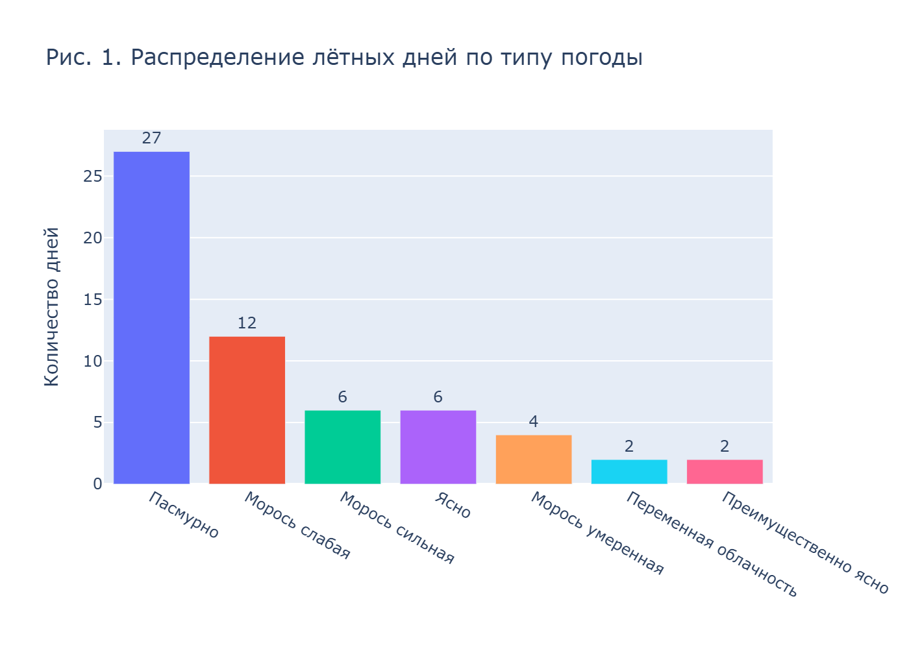

*Рис. 1. Распределение лётных дней по типу погоды.*

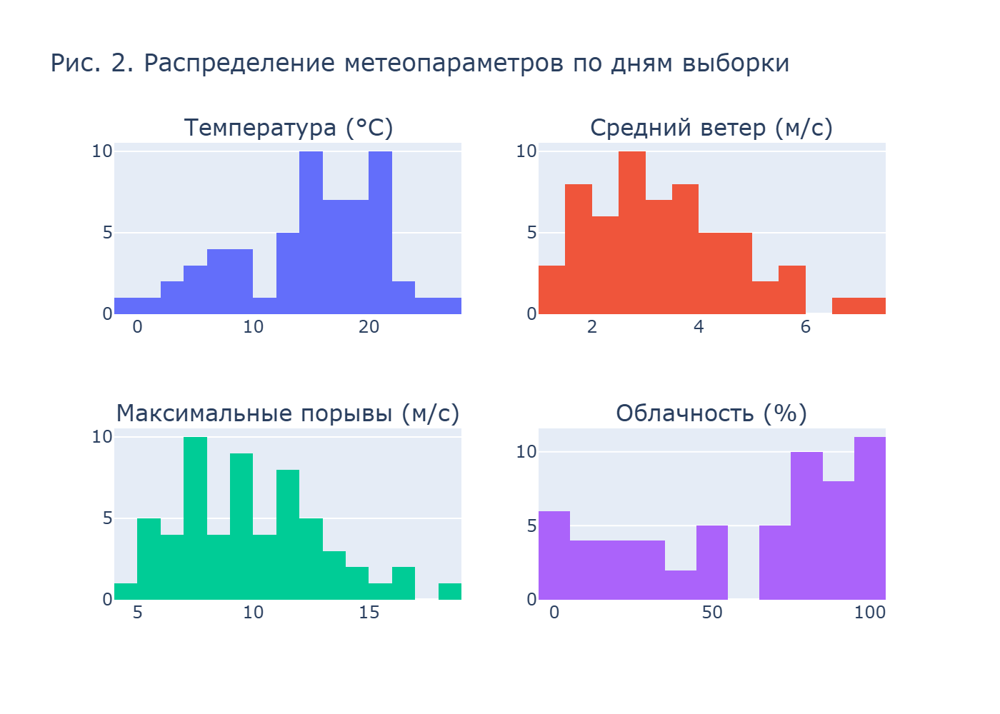

*Рис. 2. Распределение метеопараметров по дням выборки.*

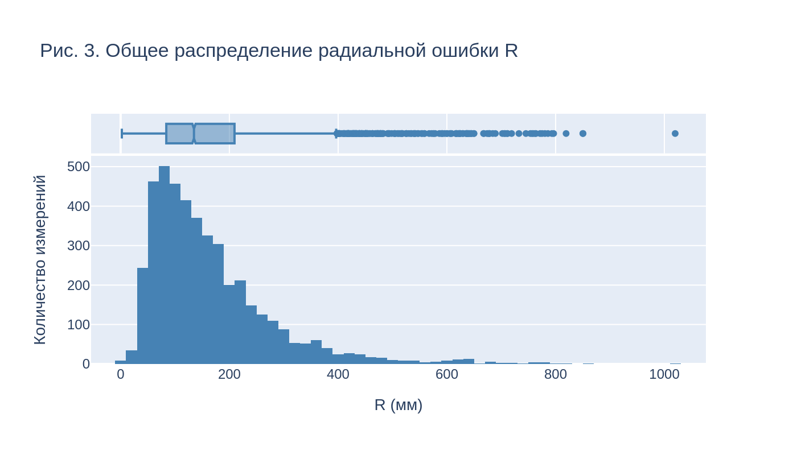

*Рис. 3. Общее распределение радиальной ошибки R.*

Рис. 1 показывает, что выборка не сведена к одному погодному сценарию: кроме 27 пасмурных дней, в неё вошли дни с моросью разной интенсивности, ясная погода и переменная облачность. Для исследования это важно, потому что точность наведения оценивается не только в спокойных, но и в неблагоприятных полевых условиях.

На рис. 2 метеопараметры покрывают рабочий диапазон испытаний: средний ветер изменяется примерно от 1 до 7 м/с, максимальные порывы — примерно от 4 до 18 м/с, облачность — от почти нулевой до 100%. Следовательно, в выборке присутствуют как мягкие, так и напряжённые режимы полёта, а фактор ветра можно проверять не формально, а по реально наблюдавшемуся диапазону.

Рис. 3 показывает правоасимметричное распределение $R$: основная масса измерений сосредоточена примерно в диапазоне 50–250 мм, но правый хвост уходит за 1000 мм. Иными словами, типичная ошибка умеренная, однако при неблагоприятных сочетаниях высоты и ветра возникают крупные промахи. Этот факт заранее задаёт ограничение для дальнейших моделей: линейное уравнение будет описывать основной тренд, но редкие хвостовые значения потребуют осторожной интерпретации.

### Описательная статистика

После общего обзора выборки перейдём от отдельных измерений к компактным характеристикам ошибки. Для каждой высоты $H$ сначала вычисляется среднее значение радиальной ошибки:

$$
\bar{R} = \frac{1}{n}\sum_{i=1}^{n} R_i.
$$

Здесь $R_i$ — ошибка в отдельном измерении, а $n$ — число измерений в высотной группе. Суммирование объединяет все наблюдения данной высоты, а деление на $n$ переводит сумму в средний уровень. Поэтому $\bar R$ используется как характеристика типичной ошибки на фиксированной высоте.

Одного среднего значения недостаточно: две высоты могут иметь близкую среднюю ошибку, но разную устойчивость результата. Поэтому дополнительно рассчитывается выборочное стандартное отклонение:

$$
s = \sqrt{\frac{1}{n-1}\sum_{i=1}^{n}(R_i - \bar{R})^2}.
$$

Разность $R_i - \bar R$ показывает отклонение отдельного измерения от среднего уровня, квадрат устраняет знак отклонения, а корень возвращает показатель в миллиметры. Иными словами, $s$ показывает разброс повторных измерений вокруг типичной ошибки. Если вместе со средним растёт и $s$, то ухудшается не только точность, но и повторяемость наведения.

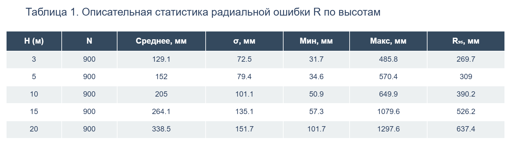

*Таблица 1. Описательная статистика радиальной ошибки R по высотам.*

Таблица показывает монотонный рост среднего уровня ошибки: от $68{,}1$ мм на высоте 3 м до $303{,}1$ мм на высоте 20 м. Увеличение почти в 4,5 раза означает, что уже на уровне описательной статистики высота $H$ является основным кандидатом на главный фактор ошибки.

Одновременно увеличивается выборочное стандартное отклонение $s$: с $23{,}8$ мм на 3 м до $142{,}5$ мм на 20 м. Следовательно, на больших высотах система не только промахивается сильнее в среднем, но и даёт менее устойчивые повторные измерения.

Важно, что разброс растёт вместе с уровнем ошибки. Относительный разброс $s/\bar R$ меняется от $0{,}35$ на малых высотах до $0{,}47$ на высоте 20 м. В рассматриваемой задаче это означает, что крупная ошибка сопровождается крупной изменчивостью, поэтому далее нужно анализировать не только средние значения, но и форму распределений в высотных группах.

### Распределение ошибки по высотам

Среднее значение и стандартное отклонение показывают общий уровень ошибки, но не раскрывают форму распределения. Для проверки устойчивости вывода рассмотрим, как при увеличении $H$ меняются медиана, межквартильный размах и правый хвост распределения $R$.

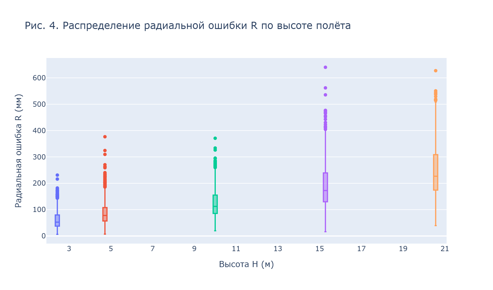

*Рис. 4. Распределение радиальной ошибки R по высоте полёта.*

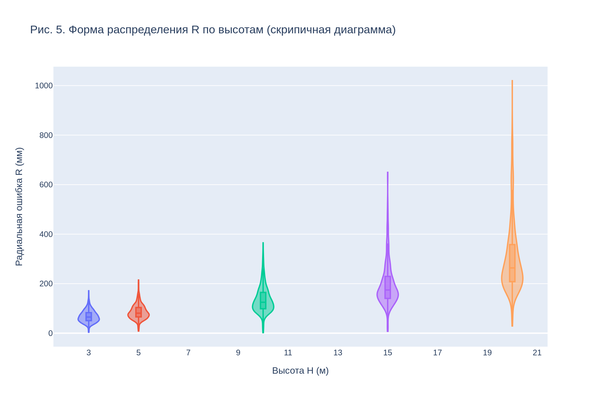

*Рис. 5. Форма распределения R по высотам (скрипичная диаграмма).*

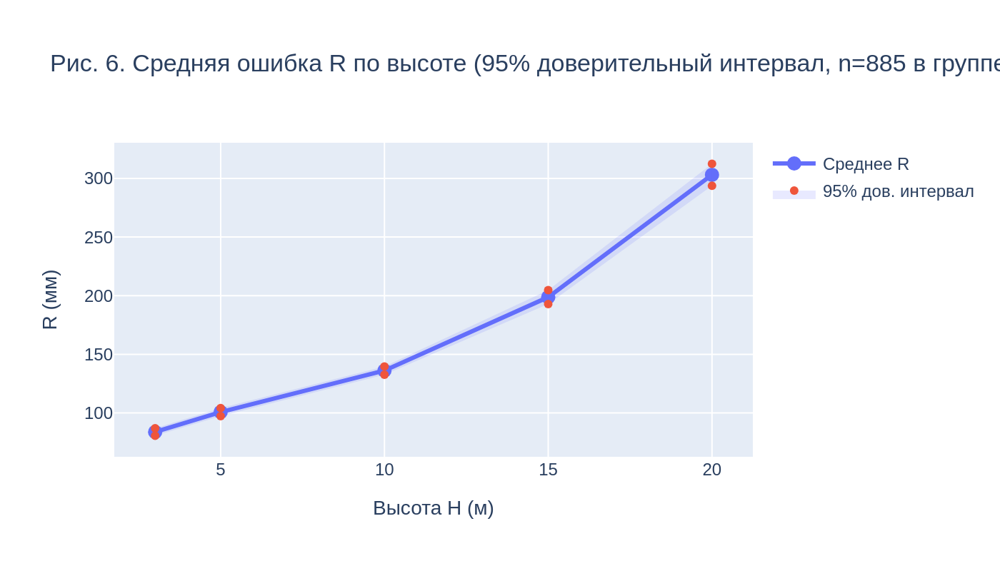

*Рис. 6. Средняя ошибка R по высоте (95% доверительный интервал, n=885 в группе).*

Рис. 4 и 5 показывают не только рост центрального уровня ошибки, но и изменение всей формы распределения. Медиана $R$ смещается примерно от $65$ мм на 3 м до $264$ мм на 20 м, а межквартильный размах расширяется от 50–83 мм до 208–358 мм. Следовательно, на больших высотах увеличивается не только типичная ошибка, но и диапазон обычных, неэкстремальных значений.

Правый хвост распределения также становится длиннее: на высоте 20 м уже около $9{,}9\%$ наблюдений превышают 500 мм, тогда как на высотах до 10 м таких измерений нет. Эти точки не являются единственной причиной роста среднего: основной сдвиг виден уже по медиане и межквартильному размаху.

На рис. 6 средние значения возрастают монотонно, а 95% доверительные интервалы между высотами практически не перекрываются. Это означает, что различия между высотными группами нельзя объяснить только случайным разбросом повторных измерений.

Физически этот результат связан с геометрическим рычагом. При малой угловой нестабильности подвеса $\delta\varphi$ линейное смещение пятна можно приближённо записать как

$$
\Delta R \approx H \cdot \tan(\delta\varphi) \approx H \cdot \delta\varphi.
$$

Здесь $\Delta R$ — линейное смещение пятна на поверхности, $H$ — высота зависания, а $\delta\varphi$ — малая угловая ошибка подвеса. Формула показывает, что одна и та же угловая ошибка на большей высоте даёт больший промах. Поэтому рост $R$ с высотой является не только статистическим фактом, но и ожидаемым геометрическим следствием. Далее проверим, почему прирост особенно усиливается на участке 15–20 м.

### Влияние рельефа на высотах 15–20 м

Монотонный рост ошибки с высотой объясняется геометрическим рычагом, но участок 15–20 м требует отдельной проверки. Испытания проводились на территории карьера: до 10–15 м БПЛА находится внутри карьерной выемки, где рельеф частично экранирует ветровое воздействие, а при подъёме выше бровки попадает в более открытый поток.

Отсюда следует проверяемая гипотеза: если рельеф действительно ослабляет ветер на меньших высотах, то при переходе к 20 м ошибка должна расти быстрее, а различие между слабыми и сильными ветровыми режимами должно увеличиваться. Поэтому далее сравниваются медианные ошибки и приросты между соседними высотами.

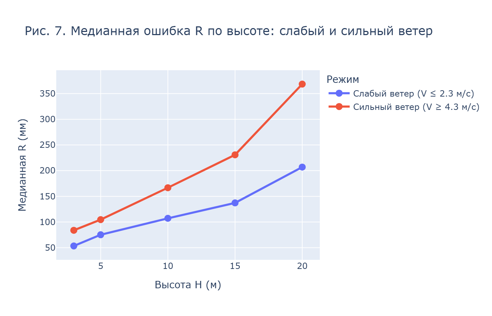

*Рис. 7. Медианная ошибка R по высоте: слабый и сильный ветер.*

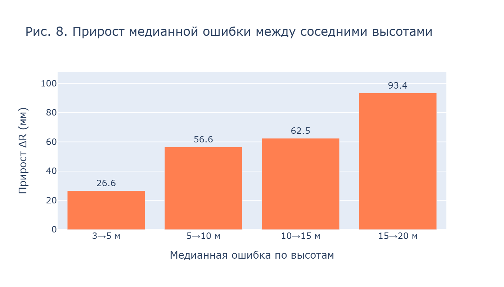

*Рис. 8. Прирост медианной ошибки между соседними высотами.*

Рис. 7 и 8 согласуются с гипотезой о выходе БПЛА из ветровой тени карьера. Прирост медианной ошибки между соседними высотами составляет $15{,}8$ мм при переходе 3→5 м, $44{,}3$ мм при 5→10 м, $49{,}3$ мм при 10→15 м и уже $89{,}3$ мм при 15→20 м. Последний переход даёт наибольший прирост, то есть рост ошибки не замедляется, а ускоряется.

На рис. 7 линии слабого и сильного ветра расходятся с высотой. На малых высотах различие между режимами умеренное, а к 20 м разрыв становится максимальным: сильный ветер поднимает медианную ошибку примерно до 440 мм, тогда как при слабом ветре она остаётся около 200 мм.

Следовательно, на малых высотах ошибка в основном задаётся геометрическим рычагом $H$, а выше бровки карьера к нему добавляется ветровая составляющая. Для дальнейшего анализа это означает, что скорость ветра $V$ нужно рассматривать не только как самостоятельный фактор, но и во взаимодействии с высотой $H$.

### Влияние ветра

После высоты следующим фактором является скорость ветра $V$. Чем сильнее ветер, тем больше угловая нестабильность подвеса и тем вероятнее кратковременное смещение лазерного пятна. В рассматриваемой задаче это смещение усиливается высотой через связь $\Delta R \approx H\cdot\delta\varphi$. Поэтому $H$ и $V$ должны рассматриваться не порознь, а вместе: нас интересует как отдельная связь $R$ с $V$, так и будущий член взаимодействия $H \times V$ в регрессионной модели.

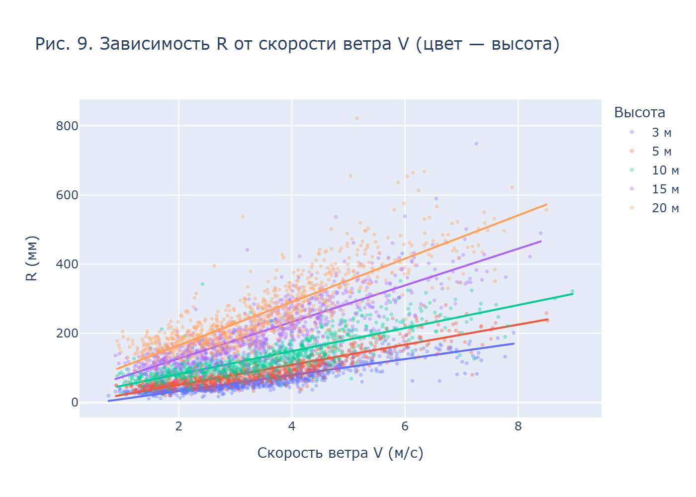

*Рис. 9. Зависимость R от скорости ветра V (цвет — высота).*

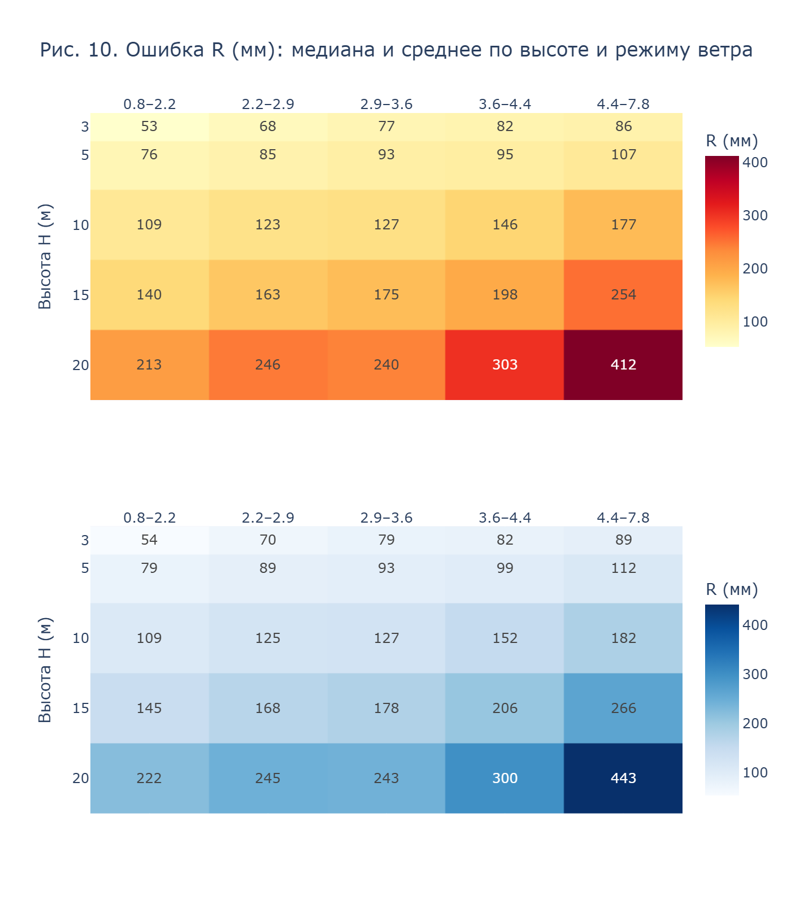

*Рис. 10. Средняя ошибка R в координатах H и V.*

На рис. 9 все линии тренда имеют положительный наклон: при увеличении скорости ветра $V$ радиальная ошибка $R$ возрастает на каждой высоте. Однако наклон для 20 м заметно больше, чем для 3–5 м: оценка прироста ошибки на 1 м/с ветра составляет около $6$ мм/(м/с) на высоте 3 м и около $77$ мм/(м/с) на высоте 20 м. Иными словами, один и тот же прирост ветра даёт более чем десятикратно более крупный промах на большой высоте.

Рис. 10 показывает тот же вывод в агрегированном виде. В зоне 3 м и слабого ветра медианная ошибка составляет около 45 мм, а в зоне 20 м и сильного ветра — около 463 мм. Такой рост возникает не из-за одного фактора, а из-за их совместного действия.

По вертикали тепловой карты изменение сильнее, чем по горизонтали: переход к большей высоте увеличивает ошибку заметнее, чем переход к соседнему ветровому режиму. Следовательно, графики подтверждают рабочую иерархию $H > V$, но одновременно требуют проверить регрессионный член $H \times V$, отвечающий за совместное действие высоты и ветра.

### Вторичные признаки: направление ветра, спутники и облачность

Высота $H$ и скорость ветра $V$ задают основную физическую картину, но в журнале также фиксировались направление ветра, число видимых спутников GNSS $N_{\text{sat}}$ и облачность $C$. Эти признаки проверяются как контрольные: они помогают убедиться, что итоговая модель по $H$ и $V$ не подменяет физический механизм случайным сопутствующим показателем.

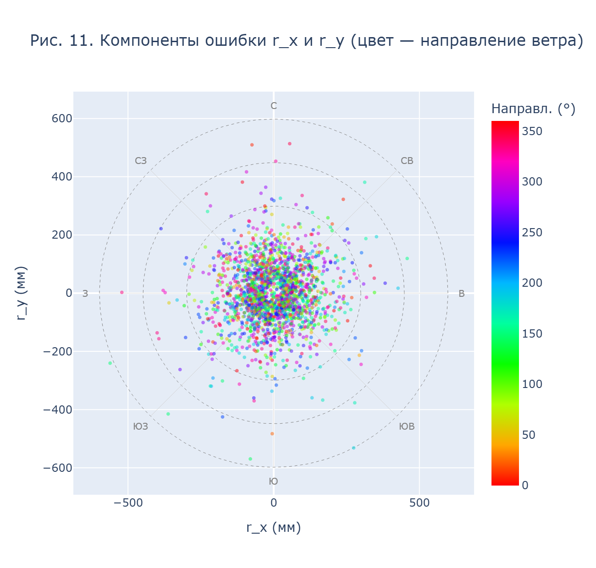

*Рис. 11. Компоненты ошибки r_x и r_y (цвет — направление ветра).*

На рис. 11 облако точек $(r_x, r_y)$ в центральной области близко к радиально симметричному: ошибки распределены вокруг начала координат без устойчивого вытягивания в одном направлении. Цвет, соответствующий азимуту ветра, перемешан по квадрантам, поэтому выраженной направленной связи между вектором ошибки и направлением ветра не наблюдается.

Для дальнейшей модели это означает, что направление ветра не требуется вводить как отдельную векторную пару признаков. В рамках имеющихся данных достаточно использовать скалярную скорость $V$, которая отражает силу ветрового воздействия на подвес и уже связана с ростом $R$.

Помимо вектора ветра, в журнале фиксировался навигационный параметр $N_{\text{sat}}$ — число видимых спутников GNSS. Связь этого показателя с ошибкой проверяется и на корреляционной диаграмме (рис. 12), и в дисперсионном анализе как контрольная ковариата. В наблюдавшемся диапазоне $N_{\text{sat}}$ лежит в пределах 16–31 при медиане 23, то есть устойчиво превышает рабочий минимум RTK-режима. Поэтому число спутников отражает скорее фон навигационных условий, чем управляемый фактор полёта. Перед формальной проверкой сначала рассмотрим общую корреляционную картину.

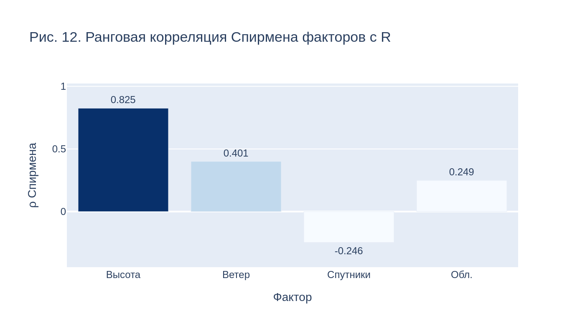

*Рис. 12. Ранговая корреляция Спирмена факторов с R.*

Рис. 12 сводит предварительный графический анализ в одну корреляционную картину. Для ранговой корреляции Спирмена исходные значения заменяются их рангами, после чего рассчитывается корреляция между ранговыми рядами:

$$
\rho_s = 1 - \frac{6\sum_{i=1}^{n} d_i^2}{n(n^2-1)}.
$$

Здесь $d_i$ — разность рангов двух признаков для $i$-го наблюдения. Иными словами, $\rho_s$ показывает, насколько согласованно признаки возрастают или убывают, не требуя линейной зависимости на исходной шкале. Значения $\rho_s$ лежат в интервале от $-1$ до $1$: $\rho_s = 1$ соответствует строгому монотонному возрастанию, $\rho_s = -1$ — строгому убыванию, $\rho_s = 0$ — отсутствию монотонной связи.

Самая сильная монотонная связь с ошибкой наблюдается у высоты: $\rho_H = 0{,}825$. Ветер занимает второе место: $\rho_V = 0{,}401$. Число спутников GNSS даёт слабую отрицательную связь $\rho_{N_{\text{sat}}} = -0{,}246$: при большем числе видимых спутников ошибка в среднем чуть ниже. Облачность даёт положительную корреляцию $\rho_C = 0{,}249$, но этот результат нельзя читать как самостоятельное физическое влияние облаков на лазерное наведение: в рассматриваемой выборке пасмурные дни чаще сопровождаются более сильным ветром.

Итак, графический и корреляционный анализ задают предварительную иерархию факторов: высота — основной источник изменения $R$, ветер — второй, число спутников и облачность требуют отдельной проверки как сопутствующие признаки. Прежде чем перейти к формальному дисперсионному анализу, отдельно посмотрим на связь $R$ и $N_{\text{sat}}$.

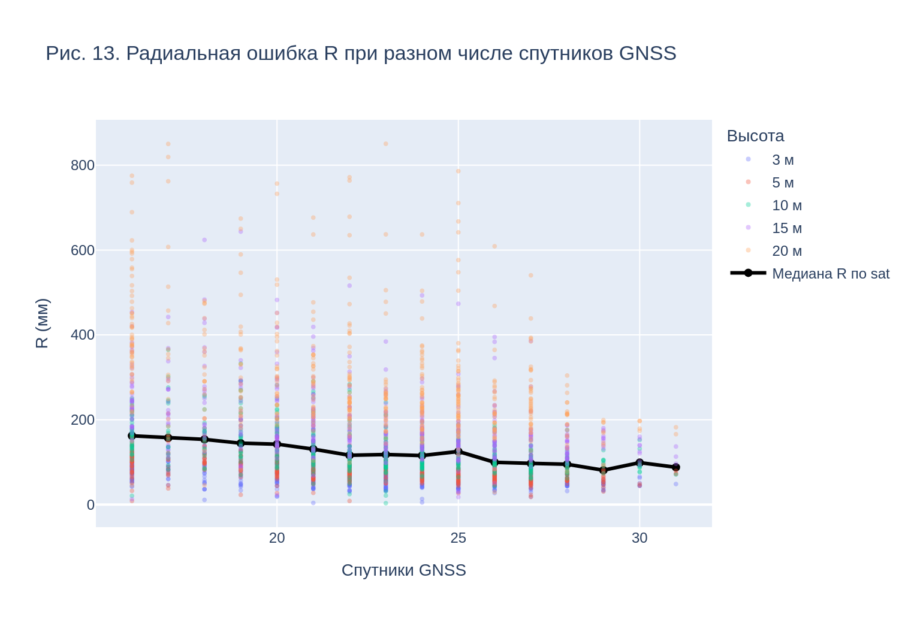

*Рис. 13. Радиальная ошибка R при разном числе спутников GNSS.*

Рис. 13 является прямой визуальной проверкой связи между $N_{\text{sat}}$ и ошибкой. На рис. 12 эта связь видна как отрицательная ранговая корреляция: при большем числе спутников $R$ в среднем снижается. Однако сама по себе такая корреляция ещё не означает, что число спутников должно войти в итоговое уравнение прогноза.

На рис. 13 медианная линия действительно постепенно убывает: при малом $N_{\text{sat}}$ типичная ошибка выше, чем при большем числе спутников. Но внутри каждого уровня остаётся широкий вертикальный разброс, а цветовая разбивка показывает, что значительная часть этого разброса связана с высотой. Иными словами, $N_{\text{sat}}$ фиксирует навигационный фон условий измерения, но не заменяет основные управляемые факторы — высоту $H$ и скорость ветра $V$.

Следовательно, число спутников сохраняется в дисперсионном анализе как контрольная ковариата, но в прогнозную регрессионную модель не включается. Такой переход позволяет учесть навигационный фон и одновременно не перегружать итоговое эксплуатационное уравнение.

### Проверка предпосылок дисперсионного анализа

Графики уже показали, что ошибка растёт с высотой и ветром, но перед дисперсионным анализом необходимо проверить, насколько данные согласуются с его базовыми предпосылками. Здесь важны две проверки: форма распределения внутри высотных групп и однородность дисперсий между группами.

Критерий Шапиро-Уилка проверяет нулевую гипотезу

$$
H_0: R \text{ в группе имеет нормальное распределение}.
$$

Для количественной проверки используется статистика

$$
W = \frac{\left(\sum_{i=1}^{n} a_i x_{(i)}\right)^2}{\sum_{i=1}^{n}(x_i - \bar{x})^2}.
$$

Здесь $x_{(i)}$ — упорядоченные значения выборки, $\bar{x}$ — среднее значение, а коэффициенты $a_i$ задаются ожидаемыми порядковыми статистиками нормального распределения. Числитель показывает, насколько порядок наблюдений похож на нормальный, а знаменатель нормирует это сравнение общим разбросом выборки. Статистика $W$ лежит в интервале от 0 до 1: чем ближе $W$ к единице, тем ближе выборка к нормальному закону. Значение $p$ здесь не следует читать изолированно: при большом $n$ даже умеренные отклонения становятся формально значимыми.

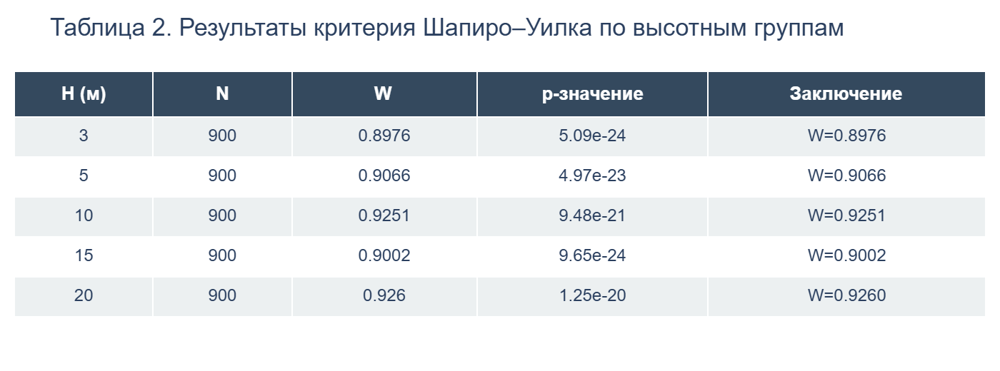

*Таблица 2. Результаты критерия Шапиро–Уилка по высотным группам.*

В каждой высотной группе содержится $n = 885$ измерений, поэтому критерий Шапиро-Уилка обладает высокой мощностью. Значения $W$ снижаются от $0{,}976$ на 3 м до $0{,}872$ на 20 м. Это означает, что распределения сохраняют нормальное ядро, но на больших высотах усиливаются правая асимметрия и влияние хвостов.

Формально $p$-значения малы во всех группах, однако это не делает дальнейший анализ непригодным. При таком объёме выборки важнее учитывать характер отклонения: оно ожидаемо для величины $R \geq 0$ и связано с редкими крупными промахами. Поэтому результат критерия используется как диагностический сигнал, а не как единственное основание для отказа от дисперсионного анализа.

---

#### Однородность дисперсий. Критерий Левена

Следующая предпосылка — равенство дисперсий между высотными группами. Критерий Левена проверяет гипотезу

$$
H_0\colon \sigma^2_1 = \sigma^2_2 = \ldots = \sigma^2_k,
$$

то есть равенство дисперсий во всех сравниваемых группах. В варианте Brown-Forsythe сначала рассчитываются отклонения наблюдений от медианы своей группы:

$$
Z_{ij}=|R_{ij}-\tilde R_j|.
$$

Здесь $R_{ij}$ — $i$-е наблюдение в $j$-й высотной группе, а $\tilde R_j$ — медиана этой группы. Затем для величин $Z_{ij}$ выполняется однофакторный дисперсионный анализ. Иными словами, использование медианы вместо среднего делает критерий устойчивым к асимметрии распределения, а $R$ как раз имеет правый хвост. В этой задаче проверка особенно важна, потому что ранее уже было видно: разброс ошибки растёт вместе с её средним уровнем.

На исходной шкале $R$ критерий Левена показывает статистически значимое различие дисперсий высотных групп. Этот результат не выглядит артефактом: в описательной статистике уже было видно, что абсолютный разброс растёт вместе с уровнем ошибки.

Следовательно, неоднородность дисперсий следует понимать как физическое свойство процесса, а не как ошибку измерений. Чем выше ожидаемая ошибка, тем шире диапазон возможных промахов, особенно при порывистом ветре. Поэтому дальнейшие выводы должны опираться не только на формальные $p$-значения, но и на размер эффекта, физическую интерпретацию и диагностику остатков.

---

#### Квантиль-квантильный график (QQ-график) остатков

Дополнительно проверим форму остатков на QQ-графике. Для каждого наблюдения остаток определяется как

$$
e_i = R_i - \hat R_i.
$$

Здесь $R_i$ — измеренная радиальная ошибка, а $\hat R_i$ — значение, рассчитанное основной линейной моделью $R \sim H + V + H{:}V$. QQ-график сопоставляет наблюдаемые квантили остатков с квантилями нормального распределения. Если точки идут вдоль теоретической прямой, нормальная аппроксимация описывает основную массу остатков; систематические отклонения на краях указывают на тяжёлые хвосты.

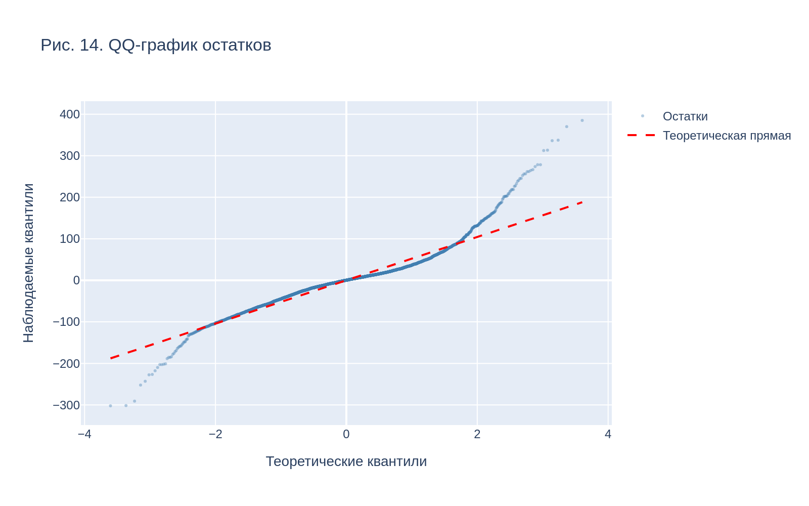

*Рис. 14. QQ-график остатков.*

На рис. 14 центральная часть остатков хорошо следует теоретической прямой: для основной массы наблюдений нормальная аппроксимация приемлема. Отклонения заметны на краях, особенно в правом хвосте, где наблюдаемые квантили уходят выше теоретических.

Это означает, что в данных есть редкие крупные ошибки, более выраженные, чем ожидалось бы при идеально нормальных остатках. С практической точки зрения такие точки согласуются с физикой эксперимента: сильные порывы ветра и кратковременные колебания подвеса создают большие промахи.

Следовательно, предпосылки ANOVA выполняются не идеально, но характер отклонений понятен и ожидаем для полевых данных. При объёме $N = 4425$ дисперсионный анализ остаётся пригодным для оценки силы факторов, если интерпретировать не только $p$-значения, но и размеры эффектов, а также проверять регрессионные остатки.

### Дисперсионный анализ

Дисперсионный анализ нужен для того, чтобы разделить общий разброс радиальной ошибки $R$ на объяснённые части и остаток. Иными словами, он отвечает не только на вопрос «значим ли фактор», но и на вопрос «какую долю изменчивости ошибки он действительно объясняет». Такая логика соответствует схеме: сначала выделяются факторы, затем оценивается их вклад, после чего формируется регрессионное уравнение для практического расчёта.

#### Ковариационный анализ (тип II)

Для совместной проверки основных и вторичных признаков используется модель

$$
R_{ij} = \mu + \alpha_{H_i} + \beta_1 V + \beta_2 N_{\text{sat}} + \beta_3 C + \varepsilon_{ij}.
$$

Здесь $\mu$ задаёт общий уровень ошибки, относительно которого оцениваются остальные влияния. Член $\alpha_{H_i}$ — поправка для $i$-й высотной группы, $i = 1\ldots 5$; высота вводится как категориальный фактор, чтобы не навязывать ей линейную форму. Коэффициент $\beta_1$ описывает вклад скорости ветра, $\beta_2$ — связь с числом видимых спутников GNSS, $\beta_3$ — связь с облачностью. Остаток $\varepsilon_{ij}$ содержит ту часть ошибки, которую эти факторы не объясняют.

$N_{\text{sat}}$ и $C$ вводятся именно как контрольные ковариаты: их роль — проверить, что эффект $H$ и $V$ не объясняется навигационными или сопутствующими погодными условиями. Это не означает, что они автоматически попадут в прогнозное уравнение. Для каждого фактора рассчитываются две меры силы эффекта:

$$
\eta^2_{\text{partial}} = \frac{SS_{\text{фактор}}}{SS_{\text{фактор}} + SS_{\text{остаток}}},
$$

$$
\omega^2 = \frac{SS_{\text{фактор}} - df_{\text{фактор}} \cdot MS_{\text{остаток}}}{SS_{\text{фактор}} + (N - df_{\text{фактор}}) \cdot MS_{\text{остаток}}}.
$$

В этих формулах $SS$ — сумма квадратов, то есть часть общего разброса, связанная с фактором или остатком; $df$ — число степеней свободы; $MS$ — средний квадрат остатка. Частичная $\eta^2$ показывает долю разброса, объяснённую фактором относительно фактора и остатка, а $\omega^2$ оценивает вклад более консервативно, с поправкой на число степеней свободы. Поэтому именно $\omega^2$ далее принимается как основная мера силы фактора.

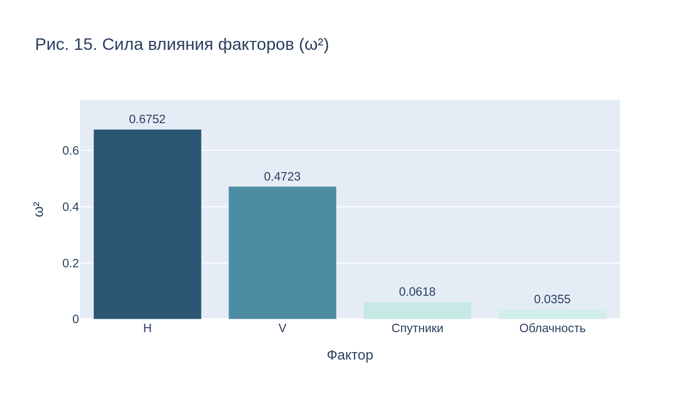

*Рис. 15. Сила влияния факторов (ω²).*

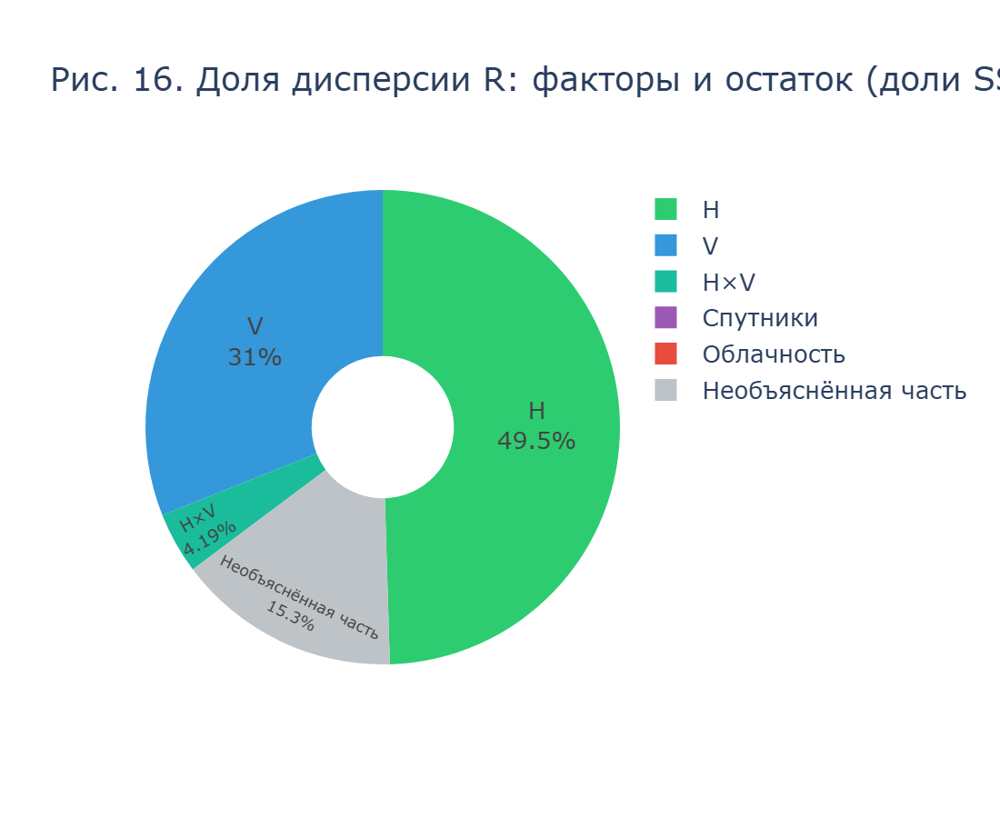

*Рис. 16. Доли SS в ANOVA: факторы и остаток.*

Таблица ANOVA показывает, что формальная значимость факторов сама по себе недостаточна для выбора регрессионной модели. При большом объёме выборки малые $p$-значения могут появляться и у слабых сопутствующих признаков, поэтому главный интерес представляет размер эффекта $\omega^2$.

Высота $H$ имеет наибольшую силу эффекта: $\omega^2_H \approx 0{,}68$. Это согласуется с физикой геометрического рычага: при увеличении $H$ одна и та же угловая ошибка подвеса превращается в больший линейный промах.

Скорость ветра $V$ занимает второе место: $\omega^2_V \approx 0{,}36$. Ветер раскачивает платформу и подвес, поэтому его вклад особенно важен в сочетании с высотой, что уже было видно на тепловой карте $H \times V$.

Число спутников и облачность дают заметно меньший вклад: $\omega^2_{N_{\text{sat}}} \approx 0{,}050$, $\omega^2_C \approx 0{,}028$. Для спутников причина методическая: число видимых аппаратов — это лишь один из частных индикаторов условий приёма, тогда как точность позиционирования определяется геометрией созвездия, статусом RTK-решения, отношением сигнал/шум, многолучёвостью и состоянием атмосферы. Поэтому одно лишь $N_{\text{sat}}$, оторванное от $\text{DOP}$ и статуса Fix/Float, отражает только грубые провалы условий приёма. Облачность рассматривается как сопутствующий погодный признак: её возможная связь с $R$ объясняется тем, что пасмурные дни чаще сопровождаются более сильным ветром.

Рис. 15 фиксирует иерархию факторов по $\omega^2$, а рис. 16 показывает доли сумм квадратов в дисперсионном разложении, включая вторичные признаки. Эти величины не следует отождествлять с $R^2$ регрессионной модели ниже, потому что спецификации моделей различаются.

Следовательно, в регрессионное моделирование включаются только высота $H$ и скорость ветра $V$. Дисперсионный анализ выполнил роль отбора факторов; теперь построим уравнение, по которому можно прогнозировать $R$ и задавать практическую область допустимых режимов.

---
### Регрессионная модель с взаимодействием $H \times V$

Дисперсионный анализ показал, какие факторы имеют самостоятельный вклад, но не даёт удобного уравнения для расчёта ожидаемой ошибки. Поэтому следующим шагом строится регрессионная модель, связывающая радиальную ошибку $R$ с высотой $H$ и скоростью ветра $V$.

В основную модель включён член взаимодействия $H \times V$. Он нужен не как формальное усложнение, а как отражение физического механизма: на большей высоте та же ветровая угловая нестабильность подвеса превращается в больший линейный промах.

Модель имеет вид

$$
R = \beta_0 + \beta_H H + \beta_V V + \beta_{HV}HV + \varepsilon.
$$

Здесь $\beta_0$ задаёт базовый уровень ошибки, относительно которого оцениваются остальные влияния. Член $\beta_H H$ описывает вклад высоты при фиксированной скорости ветра, $\beta_V V$ — вклад скорости ветра при фиксированной высоте. Произведение $HV$ выделено отдельно, потому что действие ветра зависит от высоты. Остаток $\varepsilon$ включает кратковременные порывы, вибрации подвеса и прочие непредсказанные отклонения.

Параметры оцениваются методом наименьших квадратов:

$$
\hat\beta=(X^TX)^{-1}X^Ty.
$$

Здесь $X$ — матрица наблюдений по предикторам, $y$ — вектор измеренных значений $R$, а $\hat\beta$ — вектор оценённых коэффициентов. Оценка выбирается так, чтобы минимизировать суммарный квадрат отклонений между наблюдаемыми и предсказанными $R$. В прикладном смысле модель описывает условное среднее $E(R\mid H,V)$, то есть ожидаемую радиальную ошибку при заданной высоте и скорости ветра.

Качество модели оценивается коэффициентом детерминации $R^2$, то есть долей изменчивости $R$, объяснённой уравнением. Скорректированный коэффициент $R^2_{\text{adj}}$ используется вместе с ним, потому что учитывает число предикторов и поэтому удобен для сравнения моделей разной сложности.

Полученная линейная модель на исходной шкале ошибки записывается как

$$
\hat{R} = 40{,}74 - 1{,}07H - 6{,}61V + 4{,}17HV.
$$

Здесь $\hat R$ выражается в миллиметрах, $H$ — в метрах, а $V$ — в м/с. Отдельные коэффициенты при $H$ и $V$ в модели с взаимодействием нельзя рассматривать изолированно: их смысл задаётся вместе с членом $HV$. Положительный коэффициент при $HV$ означает, что влияние ветра усиливается с высотой. Иными словами, чем выше БПЛА, тем больший линейный промах даёт та же ветровая угловая нестабильность подвеса.

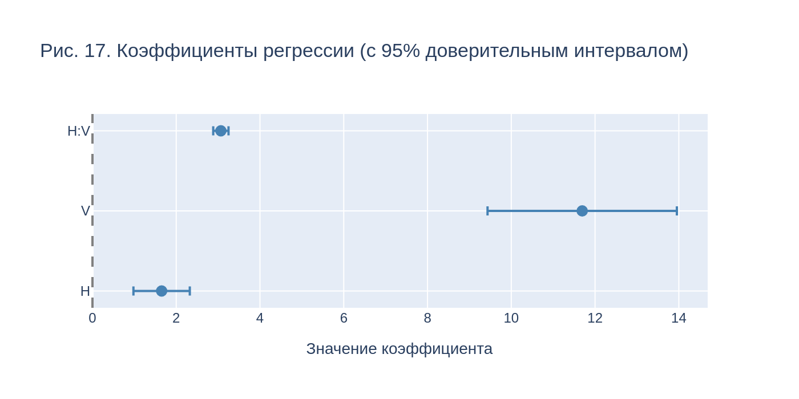

*Рис. 17. Коэффициенты регрессии (с 95% доверительным интервалом).*

Рис. 17 показывает знаки и доверительные интервалы коэффициентов основной линейной модели. Положительный коэффициент при $H:V$ не пересекает нуль, поэтому взаимодействие высоты и ветра статистически подтверждается: ветер действительно становится опаснее на больших высотах.

Абсолютные значения коэффициентов напрямую сравнивать нельзя, потому что $H$, $V$ и $H\times V$ имеют разные размерности. Поэтому вопрос «какой фактор сильнее» решается не по длине точки на рис. 17, а по $\omega^2$ из дисперсионного анализа. В этом смысле рис. 17 отвечает за направление и форму уравнения, а рис. 15 — за ранжирование факторов по практическому вкладу.

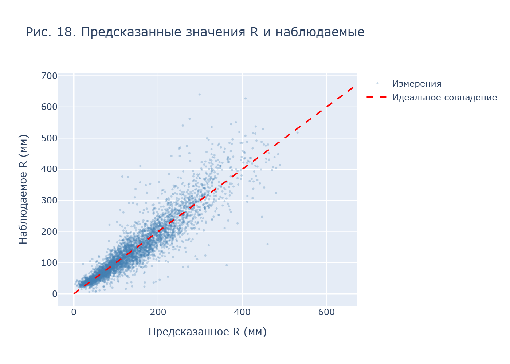

*Рис. 18. Предсказанные значения R и наблюдаемые.*

На рис. 18 красная пунктирная линия соответствует идеальному совпадению предсказанного и наблюдаемого $R$. Основное облако точек вытянуто вдоль этой линии: при малых предсказанных ошибках наблюдаемые значения также малы, а при больших — возрастают.

Однако в правой части графика разброс заметно увеличивается. При $\hat R$ порядка 300–500 мм наблюдаемые значения могут уходить значительно выше линии идеального совпадения. Иными словами, модель хорошо описывает общий тренд, но хуже воспроизводит редкие пиковые ошибки, возникающие при неблагоприятном сочетании высоты и ветра.

Для исследования это ограничение важно зафиксировать отдельно: уравнение пригодно для оценки ожидаемой ошибки, но не должно интерпретироваться как точный прогноз каждого единичного промаха. Следующий диагностический график проверяет это ограничение через остатки модели.

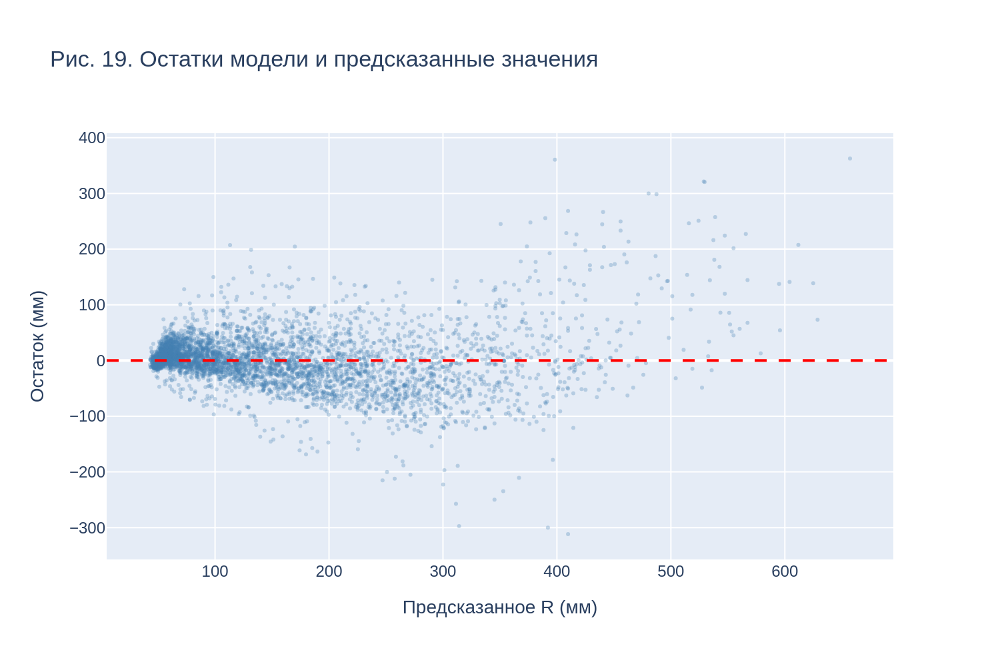

*Рис. 19. Остатки модели и предсказанные значения.*

Рис. 19 показывает остатки $e_i = R_i - \hat R_i$ в зависимости от предсказанного значения. Если бы дисперсия ошибки была постоянной, точки образовывали бы примерно одинаковую вертикальную полосу вокруг нуля на всём диапазоне $\hat R$.

Вместо этого виден веерообразный рисунок. При малых предсказанных ошибках остатки компактны, а при $\hat R$ выше 300 мм разброс резко увеличивается и появляются крупные положительные остатки. Систематического смещения всего облака относительно нуля нет: модель в среднем не завышает и не занижает ошибку. Проблема состоит именно в росте разброса.

Такой график подтверждает вывод критерия Левена: ошибка имеет гетероскедастичную, пропорциональную природу. Чем выше ожидаемая ошибка, тем шире диапазон возможных отклонений от прогноза. Следующий график показывает тот же эффект в стандартной диагностической форме scale-location.

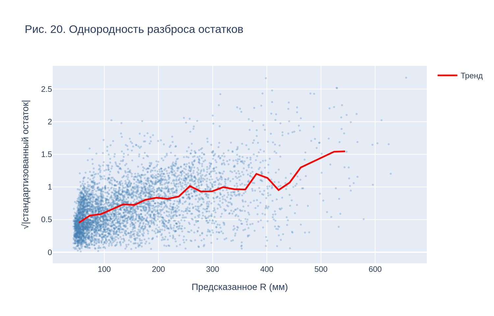

*Рис. 20. Однородность разброса остатков.*

На рис. 20 по вертикали отложена величина $\sqrt{|e_i^*|}$, где $e_i^* = e_i / \hat\sigma$ — стандартизованный остаток. Если разброс остатков постоянен, красная линия тренда должна быть примерно горизонтальной.

Здесь линия растёт вместе с предсказанным $R$. Это означает, что абсолютная ошибка модели увеличивается при увеличении уровня отклика: чем больше ожидаемая радиальная ошибка, тем шире разброс наблюдений вокруг неё.

Для дальнейшей интерпретации это важно как ограничение линейной модели на исходной шкале миллиметров: она хорошо описывает средний тренд, но хуже воспроизводит редкие крупные промахи. Поэтому сравнение ниже выполняется между двумя линейными спецификациями на одной и той же шкале: $H+V$ и $H+V+H\times V$.

#### Интерпретация модели с взаимодействием

Линейная модель с $H \times V$ описывает радиальную ошибку на исходной шкале миллиметров. Положительный член $HV$ показывает усиление ветрового влияния с высотой: один и тот же прирост скорости ветра даёт разный прирост ошибки на 3 м и на 20 м.

Модель имеет важное ограничение: редкие экстремальные промахи при сильном ветре и большой высоте предсказываются хуже, чем основной массив наблюдений. Поэтому взаимодействие $H \times V$ нужно проверить не только по физическому смыслу, но и по сравнению с более простой моделью $H+V$.

---
### Сравнение моделей $H + V$ и $H + V + H \times V$

Для проверки необходимости взаимодействия построим вторую, упрощённую модель без члена $H \times V$. Она использует те же два фактора — высоту $H$ и скорость ветра $V$, — но предполагает, что вклад ветра одинаков на всех высотах.

Если модель с взаимодействием заметно превосходит аддитивную модель $H + V$, то член $H \times V$ получает не только физическое, но и статистическое обоснование. Такое сравнение важно для практики: лишний член в эксплуатационном уравнении оправдан только тогда, когда он заметно улучшает описание ошибки и имеет понятный физический смысл.

Спецификация аддитивной модели имеет вид

$$
R = \beta_0 + \beta_H H + \beta_V V + \varepsilon.
$$

Здесь $\beta_H$ показывает среднее изменение ошибки при увеличении высоты на 1 м, а $\beta_V$ — среднее изменение ошибки при увеличении скорости ветра на 1 м/с. В отличие от основной модели, здесь нет члена $HV$, поэтому влияние ветра считается одинаковым на всех высотах. Эта модель служит контрольной, более простой формой уравнения.

Численно аддитивная модель записывается как

$$
\hat{R} = \hat\beta_0 + \hat\beta_H H + \hat\beta_V V.
$$

В этой записи коэффициенты читаются проще, чем в модели с взаимодействием: каждый метр высоты и каждый 1 м/с ветра имеют один средний вклад по всей выборке. Но эта простота достигается ценой важного ограничения: модель не различает влияние ветра на 3 м и на 20 м.

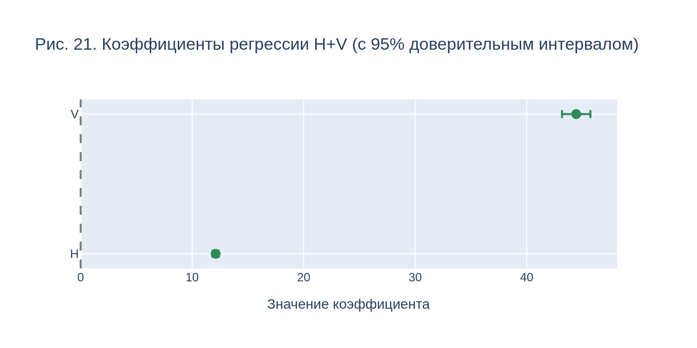

*Рис. 21. Коэффициенты регрессии H+V (с 95% доверительным интервалом).*

Рис. 21 показывает ожидаемые знаки коэффициентов аддитивной модели: высота и ветер увеличивают ошибку. Доверительные интервалы не пересекают нуль, поэтому оба фактора имеют самостоятельный статистический вклад.

По сравнению с моделью $H \times V$ коэффициент при высоте здесь заметно больше: $\hat\beta_H \approx 13{,}2$ мм/м в аддитивной модели против $\hat\beta_H \approx -1{,}1$ мм/м в модели с взаимодействием. Это означает, что аддитивная модель вынуждена включить часть совместного эффекта $H\times V$ в основной коэффициент при $H$. Уравнение получается проще, но менее физически точным: оно не показывает, что ветер на большой высоте действует сильнее.

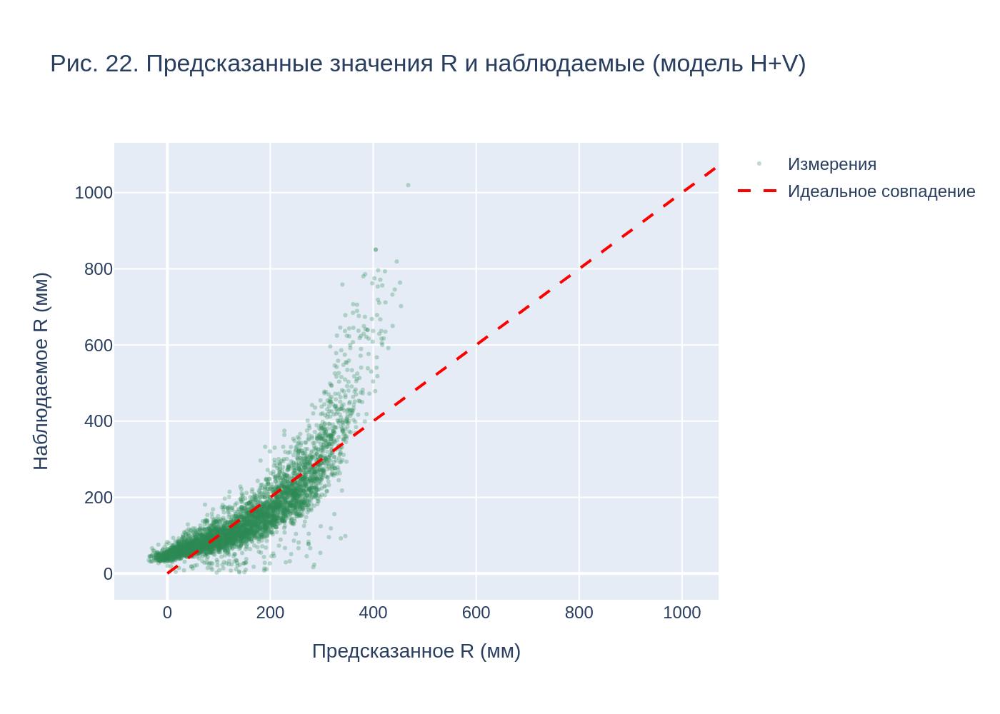

*Рис. 22. Предсказанные значения R и наблюдаемые (модель H+V).*

На рис. 22 аддитивная модель также воспроизводит общий тренд: малые предсказанные ошибки соответствуют малым наблюдаемым значениям, а большие — большим. Это подтверждает, что даже без взаимодействия основные факторы выбраны верно.

Ограничение видно в зоне крупных ошибок. Там облако шире, а пиковые наблюдения хуже ложатся на линию идеального совпадения. Причина та же: модель усредняет действие ветра по всем высотам и не выделяет режим, где большой $H$ усиливает влияние $V$.

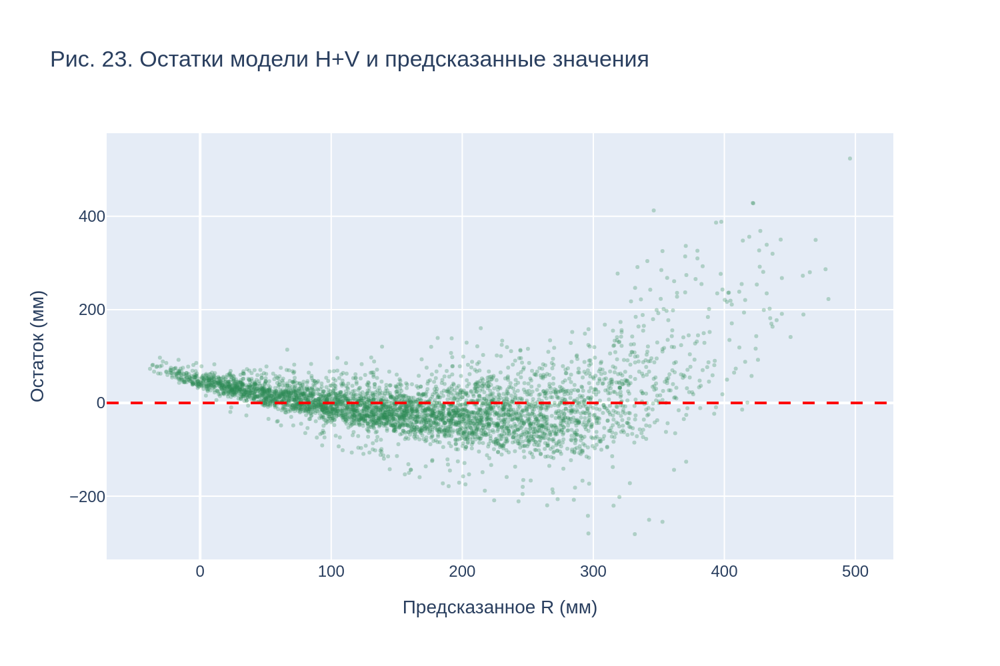

*Рис. 23. Остатки модели H+V и предсказанные значения.*

Рис. 23 показывает, что гетероскедастичность сохраняется и в аддитивной модели. При малых предсказанных значениях остатки компактны, а при больших $\hat R$ разброс резко расширяется.

Это означает, что проблема не связана только с членом $H \times V$. Она глубже: сама ошибка имеет пропорциональную природу, поэтому на шкале миллиметров абсолютный разброс растёт вместе с уровнем $R$.

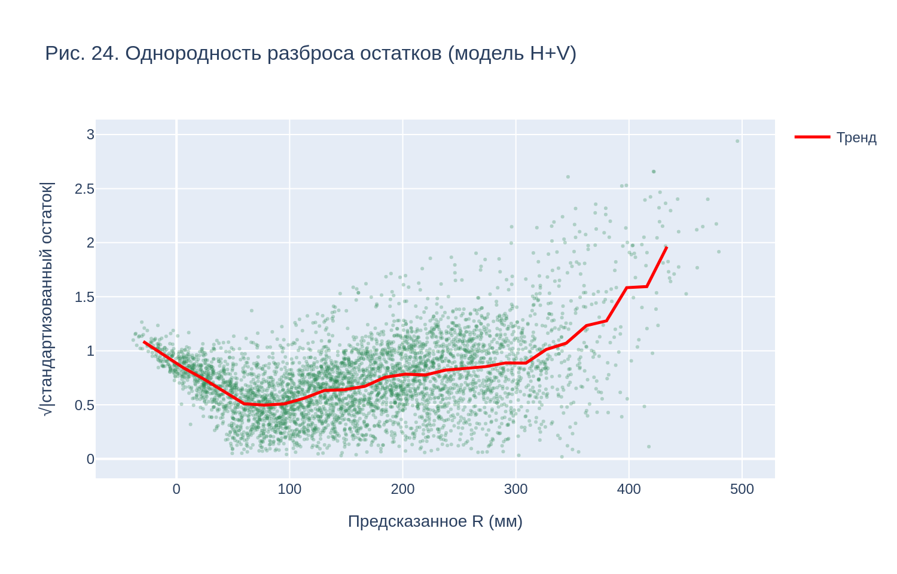

*Рис. 24. Однородность разброса остатков (модель H+V).*

Рис. 24 в диагностической форме подтверждает тот же вывод и распространяет его на упрощённую модель: обе спецификации оцениваются в одинаковых условиях — на исходной шкале миллиметров, с общим ограничением по хвостам распределения. Поэтому решающим становится не устранение гетероскедастичности любой ценой, а прирост объясняющей способности и физическая корректность члена $H\times V$.

Сравнение двух линейных спецификаций удобно свести в таблицу:

| Модель | $R^2$ | $R^2_{\text{adj}}$ | Число параметров |
|---|---|---|---|
| $H + V$ | $0{,}717$ | $0{,}717$ | 3 |
| $H + V + H\times V$ | $0{,}814$ | $0{,}814$ | 4 |

Прирост $\Delta R^2 \approx 0{,}10$ означает, что член взаимодействия объясняет дополнительно около $10\%$ полной изменчивости $R$. Для одной добавленной переменной это существенный прирост: он показывает, что совместное действие высоты и ветра является не только физически ожидаемым, но и статистически выраженным.

Следовательно, аддитивная модель полезна как простая референсная форма, но основная эксплуатационная оценка далее строится по модели с взаимодействием. Она почти не усложняет расчёт и прямо связывает статистику с механизмом геометрического рычага.

### Практическая область допустимых полётов

После построения регрессионной модели можно перейти от статистического описания к инженерному ограничению: определить, при каких сочетаниях высоты $H$ и скорости ветра $V$ полёт остаётся допустимым по точности. Рабочий допуск принят равным

$$
R_{\max}=200\text{ мм}.
$$

Основная регрессионная модель даёт среднее ожидаемое значение ошибки $R_{\text{ср}}(H,V)$. Это полезная характеристика общего уровня точности, но для эксплуатационного ограничения её недостаточно. Если при заданных $H$ и $V$ средняя ошибка равна 180 мм, отдельные полёты всё равно могут дать 220–250 мм из-за порывов ветра, кратковременных колебаний подвеса и других случайных возмущений. Поэтому рабочая область должна учитывать не только средний уровень, но и разброс ошибки.

Для этого вводится расчётная величина $R_{95}(H,V)$. Она означает такой уровень радиальной ошибки, ниже которого ожидается примерно 95% полётов при данных $H$ и $V$. Иными словами, если

$$
R_{95}(H,V) \leq R_{\max},
$$

то в данном режиме основная часть измерений укладывается в допуск 200 мм, а вероятность превышения остаётся малой. Если же $R_{95}(H,V)>R_{\max}$, режим считается недопустимым, даже если средняя ошибка ещё выглядит приемлемой.

В расчёте $R_{95}(H,V)$ используется та же экспериментальная база и те же основные факторы, что и в регрессионном анализе: высота и скорость ветра. При этом дополнительно учитывается, что при сильном ветре рост ошибки становится нелинейным, особенно на малых высотах. Поэтому граница допустимых полётов на рис. 25 является не заменой основной регрессионной модели, а её инженерным продолжением: средняя модель показывает ожидаемый уровень ошибки, а линия $R_{95}=200$ мм показывает безопасный предел с учётом разброса.

Итоговое правило для эксплуатации записывается просто:

$$
R_{95}(H,V) \leq 200\text{ мм}.
$$

Все точки плоскости $(H,V)$, для которых это условие выполняется, образуют область допустимых полётов. Остальная часть графика относится к запретной зоне.

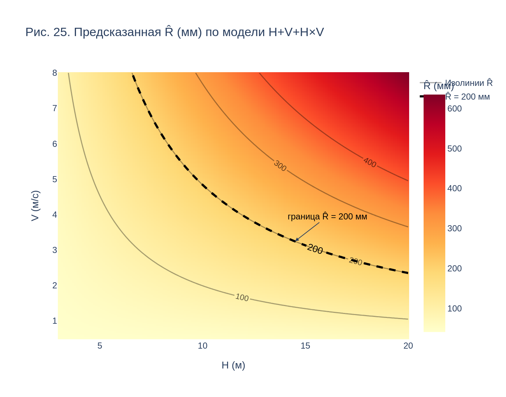

*Рис. 25. Эксплуатационный коридор (H, V): средняя ошибка и 95-й процентиль.*

Рис. 25 показывает практическую область допустимых полётов в координатах «высота — ветер». Цветовой фон соответствует среднему прогнозу ошибки $R_{\text{ср}}(H,V)$: светлые области отвечают меньшей ожидаемой ошибке, тёмные — большей. Изолинии 100, 200 и 300 мм помогают читать общий уровень ошибки на графике.

Главной эксплуатационной границей является сплошная чёрная линия. Она проведена по условию

$$
R_{95}(H,V)=200\text{ мм}.
$$

Ниже этой линии расчёт показывает, что примерно 95% полётов должны укладываться в рабочий допуск. Выше этой линии находится запретная зона: там средний прогноз может ещё не выглядеть критичным, но отдельные полёты слишком часто выходят за предел 200 мм. Поэтому затемнение на графике следует читать как область повышенного риска, а не просто как область больших средних значений.

Таблица $V_{\max}(H)$ переводит эту границу в удобное правило планирования. Для каждой высоты она показывает максимальную скорость ветра, при которой условие $R_{95}(H,V)\leq200$ мм ещё выполняется. На малых высотах $H=3$–$5$ м ограничение появляется уже при ветре порядка 3.6–4.4 м/с, потому что сильный ветер у земли даёт резкие кратковременные сдвиги. На больших высотах допустимый ветер также снижается, но уже по другой причине: с ростом $H$ одно и то же угловое отклонение подвеса превращается в больший линейный промах на поверхности.

---
## Выводы

1. Основным фактором формирования радиальной ошибки является высота полёта $H$. Средняя ошибка увеличивается от 68 мм на высоте 3 м до 303 мм на высоте 20 м, а выборочное стандартное отклонение растёт вместе со средним. Этот результат имеет прямое физическое объяснение: при малой угловой нестабильности подвеса линейный промах приближённо равен $\Delta R \approx H\,\delta\varphi$.

2. Скорость ветра $V$ занимает второе место по влиянию на ошибку. Графики и регрессионная модель показывают, что ветер особенно опасен на больших высотах: положительный член $H \times V$ означает, что один и тот же прирост $V$ даёт больший промах при большем $H$. Это согласуется с наблюдением по карьерному рельефу: на участке 15–20 м БПЛА выходит из частичной ветровой тени, и прирост медианной ошибки становится максимальным.

3. Число спутников $N_{\text{sat}}$ и облачность $C$ рассматриваются как контрольные ковариаты. Их вклад заметно меньше: $\omega^2_{N_{\text{sat}}} \approx 0{,}05$ и $\omega^2_C \approx 0{,}03$ против $\omega^2_H \approx 0{,}68$ и $\omega^2_V \approx 0{,}36$. В наблюдавшемся диапазоне число спутников устойчиво превышает рабочий минимум RTK-режима, а связь облачности с ошибкой объясняется тем, что пасмурные дни чаще сопровождаются более сильным ветром. Поэтому в итоговое прогнозное уравнение эти признаки не вводятся.

4. Сравнение моделей показывает, что линейная модель с взаимодействием $H + V + H\times V$ объясняет около 81% изменчивости $R$ и лучше связывает статистику с физикой процесса, чем аддитивная модель $H + V$ ($R^2 \approx 0{,}72$). Аддитивная модель полезна как простая референсная форма, однако она не показывает усиление ветрового воздействия с высотой и поэтому занижает риск полётов в высотно-ветровых режимах.

5. Практический вывод состоит в том, что при требовании удерживать радиальную ошибку в пределах 200 мм оператор должен ограничивать высоту и скорость ветра не только по среднему прогнозу, но и по расчётному уровню $R_{95}$. Рабочая граница проводится по условию $R_{95}(H,V)\leq200$ мм: оно означает, что примерно 95% полётов в данном режиме должны укладываться в рабочий допуск. Поэтому режимы с сильным ветром не считаются допустимыми автоматически даже на минимальной высоте.
